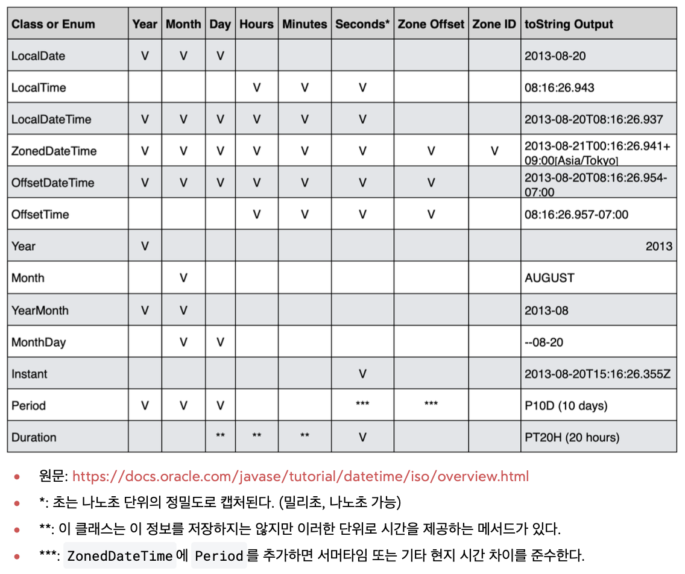

## 날짜와 시간 라이브러리가 필요한 이유 

> **날짜와 시간 차이 계산**<br>특정 날짜에서 다른 날짜까지의 정확한 일수를 계산하는 것은 생각보다 복잡하다. <br>윤년 ,각 달의 일수 등을 모두 고려해야 하며, 간단한 뺄셈 연산으로는 정확한 결과를 얻기 어렵다.
>
> **윤년 계산**<br>윤년은 보통 4년마다 한 번씩 발생하지만 100년 단위일 때는 윤년이 아니며, 400년 단위일 때는 다시 윤년이다. <br>예를들어 2000년과 2020년은 윤년이지만, 1900년과 2100년은 윤년이 아니다. 
>
> **일광 절약 시간 변환(Daylighting Saving Time-DST)**<br>국가나 지역에 따라 시간을 1시간 앞당기거나 늦추는 썸머타임 제도를 도입하기도 한다. 국가와 지역에 따라 적용 여부와 시작 및 종료 날짜가 다르므로 날짜와 시간 계산 시 1시간의 오차가 발생할 가능성이 있다.
>
> **타임존 계산**<br>세계는 다양한 타임존으로 나뉘어 있으며, 각 타임존은 UTC(협정 세계시)로부터의 시간 차이로 정의된다.<br> 타임존 간의 날짜와 시간 변환을 정확히 계산하는 것은 복잡하다.
>
> * GMT, UCT(Universal  Time Coordinated), LONDON : 세계 시간의 기준이 되는 00:00 시간대이다.

위와 같은 복잡성 때문에 <mark>개발 환경에서는 날짜와 시간을 처리하기 위해 잘 설계된 라이브러리를 사용해야 한다</mark>. <br>이러한 라이브러리는 위의 문제점에 대한 계산을 추상화하여 제공하므로 개발자는 보다 안정적이고 정확하며 효율적인 코드를 작성할 수 있다.

### 자바의 날짜 라이브러리

1. `java.util.Date` > JDK 1.0 ~ 
   - 초기의 Date 클래스는 타임존을 제대로 처리할 수 없었고, 날짜와 관련된 연산 또는 시간의 증감을 제대로 처리하지 못하였다.
   - 또한 Date클래스는 가변객체여서 외부에서 값을 쉽게 변경할 수 있기 때문에 이와 관련한 사이드 이펙트가 발생하기 쉬웠다.
     <br>**→ java.util.Calendar클래스 도입**

2. `java.util.Calendar`

   - 날짜와 시간 연산을 위한 추가 메서드를 제공하였다.

   - 복잡하고 직관성이 떨어지며, 일부 사용 사례에서는 성능이 떨어지는 문제점을 가졌다.

   - 마찬가지로 가변객체이기 때문에 사이드 이펙트, 스레드 안정성 등의 문제가 발생하였다. 
     <br>**→Joda-Time 오픈소스 라이브러리의 도입으로 사용성, 성능, 불변 문제 해결**

3. `Joda-Time`
   - 표준 라이브러리가 아니므로 자바 프로젝트에 포함되지 않아 외부 라이브러리를 별도로 추가해야하는 불편함이 있었다.

4. `java.time.패키지`

   - 이전 API들의 문제를 해결하면서 사용성, 성능, 스레드 안정성, 타임존 처리 등의 문제에서 크게 개선되었다.

   - 변경 불가능한 불변 객체로 설계되어있다.

   - `LocalDate`, `LocalTime`, `LocalDateTime`, `ZoneDateTime`등의 클래스를 포함한다.

   - Joda-Time의 많은 기능을 가져왔다.



### 📌 LocalDate, LocalTime, LocalDateTime

**LocalDate** : 날짜만 표현할 때 사용한다.  ex) 1993-2-25<br>**LocalTime**: 시간만 표현할 때 사용한다. ex) 08:20:30:213<br>**LocalDateTime** : LocalDate와 LocalTime을 합한 개념이다.

→ 앞의`Local`은 세계 시간대를 고려하지 않아서 타임존이 적용되지 않는다는 것을 의미한다. 특정지역의 날짜와 시간을 고려할 때만 사용한다. <br>ex) 애플리케이션 개발시 국내 서비스만 고려할 때.

#### LocalDate

```java
import java.time.LocalDate;

public class LocalDateMain {
    public static void main(String[] args) {
        LocalDate now = LocalDate.now();
        LocalDate ofDate = LocalDate.of(1993, 2, 25);
        System.out.println("오늘 날짜 : " +now);
        System.out.println("지정 날짜 : " + ofDate);

        //계산(불변)
        ofDate = ofDate.plusDays(10);
        System.out.println("지정 날짜 + 10d : " + ofDate);
    }
}
```

⚠️모든 날짜 클래스는 불변이다. 따라서 변경이 발생하는 경우 새로운 객체를 생성해서 반환하므로 <u>반환값을 꼭 받아야한다</u>.

#### LocalTime

```java
ublic class LocalTimeMain {
    public static void main(String[] args) {
        LocalTime now = LocalTime.now();
        LocalTime ofTime = LocalTime.of(11, 2, 25);
        System.out.println(now);
        System.out.println(ofTime);
        //계산 불변
        LocalTime plusSeconds = ofTime.plusSeconds(30);
        System.out.println(plusSeconds);
    }
}
```

#### LocalDateTime

```java
public class LocalDateTimeMain {
    public static void main(String[] args) {
        LocalDateTime nowDt = LocalDateTime.now();
        LocalDateTime ofDt = LocalDateTime.of(1993, 02, 25, 21, 20, 14);
        System.out.println(nowDt);
        System.out.println(ofDt);

        //날짜와 시간 분리
        LocalDate localDate = ofDt.toLocalDate();
        LocalTime localTime = ofDt.toLocalTime();

        //날짜와 시간 합체
        LocalDateTime.of(localDate, localTime);

        //계산(불변)
        LocalDateTime ofDtPlus = ofDt.plusDays(1000);
        LocalDateTime ofYearPlus = ofDt.plusYears(15);

        //비교
        /*현재 날짜 시간이 지정 날짜 시간보다 이전인가? 이후인가? 같은가?*/
        boolean isBeforeDay = nowDt.isBefore(ofDt);
        boolean isAfterDay = nowDt.isAfter(ofDt);
        boolean isEqualDay = nowDt.isEqual(ofDt);
    }
}
```

<mark>isEquals() vs equals()</mark><br>`isEqulas()`는 단순히 비교 대상이 시간적으로 같으면 true를 반환한다. 객체가 다르고 타임존이 달라도 시간적으로 같으면 true를 반환한다는 이야기다.<br>`equls()`는 객체의 타입, 타임존 등등 내부의 모든 데이터 구성요소가 같아야 true를 반환한다.

### 📌 ZonedDateTime, OffsetDateTime
####  ZonedDateTime
시간대를 고려한 날짜와 시간을 표현할 때 사용한다. 타임존을 포함한다. 서머타임이 적용된다.<br>자바는 타임존을 `ZoneId`클래스로 제공한다.

```java
import java.time.ZoneId;

public class ZoneIdMain {
    public static void main(String[] args) {
        /* 이용 가능한 ZoneId 목록 출력 */
        for(String availableZoneId : ZoneId.getAvailableZoneIds()) {
            ZoneId zoneId = ZoneId.of(availableZoneId);
            System.out.println(zoneId + " | " + zoneId.getRules());
        }
        ZoneId zoneId = ZoneId.systemDefault();
        System.out.println("ZoneId.systemDefault : "+zoneId);

        ZoneId zoneSeoul = ZoneId.of("Asia/Seoul");
        System.out.println("ZoneId.seoul : " + zoneSeoul);
    }
}

public class ZonedDateTimeMain {
    public static void main(String[] args) {
        ZonedDateTime nowZdt = ZonedDateTime.now();
        System.out.println("nowZdt = " + nowZdt);
        //타임존 변경
        ZonedDateTime SeoulDt = nowZdt.withZoneSameInstant(ZoneId.of("Asia/Seoul"));
        System.out.println("SeoulDt : "+SeoulDt);

        LocalDateTime localDateTime = LocalDateTime.of(2030, 1, 1, 13, 30, 50);
        ZonedDateTime zdt1 = ZonedDateTime.of(localDateTime, ZoneId.of("Asia/Seoul"));
        System.out.println(zdt1);

        ZonedDateTime zdt2 = ZonedDateTime.of(2030, 1, 1, 13, 30, 50, 0, ZoneId.of("Asia/Seoul"));
        System.out.println(zdt2);
    }
}
```

####  OffSetDateTime
시간대를 고려한 날짜와 시간을 표현한지만 타임존으 개념은 포함되지 않는다. 서머타임이 적용되지 않는다.

```java
public class offSetDateTimeMain {
    public static void main(String[] args) {
        OffsetDateTime now = OffsetDateTime.now();
        System.out.println("now : " +now);

        LocalDateTime ldt= LocalDateTime.of(2030, 1, 1, 13, 30, 50);
        OffsetDateTime odt = OffsetDateTime.of(ldt, ZoneOffset.of("+01:00"));
        System.out.println(ldt);
        System.out.println(odt);
    }
}
```

<mark>ZonedDateTime vs OffSetDateTime</mark>

`ZoneDateTime`은 구체적인 지역 시간대를 다룰 때 사용하며, 일광 절약 시간을 자동으로 처리할 수 있다. 사용자 지정시간대에 따른 시간 계산이 필요할 때 적합하다. <br>`OffsetDateTime`은 UTC와의 시간 차이만을 나타낼 때 사용하며, 지역 시간대의 복잡성을 고려하지 않는다. 시간대 변환 없이 로그를 기록하고, 데이터를 저장하고 처리할 때 적합하다. 

**→ 두 클래스 모두 글로벌 서비스를 제공하지 않는다면 잘 사용하지 않는다.**


### 📌 Year, Month, YearMonth, MonthDay

년, 월, 년월, 월일을 각각 다룰 때 사용하는 클래스지만 자주 사용하지는 않는다.<br>`DayOfWeek`와 같이 월,화,수,목,금,토,일 등을 다루는 클래스도 있다.

### 📌 Instant - 기계 중심의 시간

`Instant` UTC를 기준으로 하는 시간의 한 지점을 나타낸다. 날짜 시간을 나노초의 정밀도로 표현하며 1970년 1월 1일 0시0분0를 기준으로 경과한 시간으로 계산된다. 쉽게 이야기하여 초데이터만 들어 있다. (나노초)

> **Epoch 시간(Unix timestamp)**
>
> 컴퓨터 시스템에서 시간을 나타내는 방법 중 하나이다. 1970년 1월 1일 00:00:00 UTC부터 현재까지 경과된 시간을 초 단위로 표현한 것이며, 시간대에 영향을 받지 않는 절대적인 시간 표현 방식이다.

####  Instant의 특징

- 장점
  - **시간대 독립성** : 시간대에 영향을 받지 않으므로 전 세계 어디서나 동일한 시점을 가리키는데 유용하다.
  - **고정된 기준점** : 모둔 Instatnt는 기준이 같기 때문에 시간 계산 및 비교가 명확히 일관된다.
- 단점
  -  **사용자 친화적이지 않음** : 기계적인 시간 처리에는 적합하지만, 사람이 읽고 이해하기에는 직관적이지 못하다. 
  - **시간대 정보 부재** : 시간대 정보가 포함되어 있지 않아, 특정 지역의 날짜와 시간으로 변환하려면 추가적인 작업이 필요하다.
- 사용 예
  - **전 세계적인 시간 기준이 필요한 경우** : 로그 기록, 트랜잭션 타임 스탬프, 서버 간의 시간 동기화등이 해당
  - **시간대 변환 없이 시간 계산이 필요한 경우** : 시간대의 변화 없이 순수하게 시간의 흐름만을 다루고 싶다면 `Instant`가 적합하다.
  - **데이터 저장 및 교환** : 데이터베이스에 날짜와 시간 정보를 저장하거나, 다른 시스템과 날짜와 시간 정보를 교환할 때 사용하면 데이터 일관성을 유지하기 쉽다.

```java
public class InstantMain {
    public static void main(String[] args) {
        Instant now = Instant.now();
        System.out.println(now);

        ZonedDateTime zNow = ZonedDateTime.now();
        Instant from = Instant.from(zNow);
        System.out.println(from);

        Instant epochStart = Instant.ofEpochSecond(0);
        System.out.println("epochStart : " + epochStart);

        //계산
        Instant later = epochStart.plusSeconds(3600);
        System.out.println("plus 1hour : "+later);

        //조회
        long laterEpochSecond = later.getEpochSecond();
        System.out.println(laterEpochSecond);
    }
}

```


### 📌 Period, Duration


- 특정 시점의 시간(시각)

  - 이 프로젝트는 2013년 8월 16일까지 완료해야해.
  - 내 생일은 2월25일이야.

  **두 날짜 사이의 간격을 년,월,일 단위로 나타낸다 - Period**

  ```java
  public class PeriodMain {
      public static void main(String[] args) {
          Period period = Period.ofDays(10);
          System.out.println(period);
  
          //계산에 사용
          LocalDate currentDate = LocalDate.of(2030, 1, 1);
          LocalDate plusDate = currentDate.plus(period);
          System.out.println(currentDate);
          System.out.println(plusDate);
  
          //기간 차이
          LocalDate startDate = LocalDate.of(2023, 1, 1);
          LocalDate endDate = LocalDate.of(2023, 4,2);
          Period between = Period.between(startDate, endDate);
          System.out.println(between);
          System.out.println("년 : "+between.getYears()+", 개월 : "+between.getMonths() + ", 일 : "+between.getDays());
      }
  }
  ```

  

- 시간의 간격(기간)

  - 이 프로젝트는 3개월이 남았어
  - 라면은 3분동안 끓여야해 

  **두 시간 사이의 간격을 시,분,초(나노초) 단위로 나타낸다 - Duration**
  
  ```java
  public class DurationMain {
      public static void main(String[] args) {
          Duration duration = Duration.ofMinutes(30);
          System.out.println(duration);
  
          LocalTime lt = LocalTime.of(1, 0);
          System.out.println(lt);
  
          //계산에 사용
          LocalTime plusTime = lt.plus(duration);
          System.out.println(plusTime);
  
          //시간 차이
          LocalTime startTime = LocalTime.of(9, 0);
          LocalTime endTime = LocalTime.of(10, 0);
          Duration between = Duration.between(startTime, endTime);
          System.out.println("차이 : " + between.toSeconds());
          System.out.println("근무시간 : " + between.toHours());
      }
  }
  
  ```
  
  
