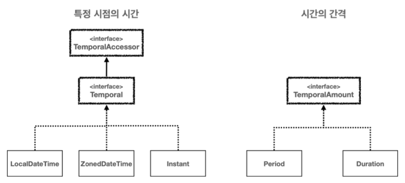

## 날짜와 시간의 핵심 인터페이스

날짜와 시간은 <u>특정 시점의 시간(시각)</u>과 <u>시간의 간격(기간)</u>으로 나눌 수 있다. 



- **특정 시점의 시간** : <u>Temporal(TemporalAccessor 포함)인터페이스</u>를 구현한다.

  - TemporalAccessor : 날짜와 시간을 읽기 위한 기본 인터페이스, 날짜와 시간 정보를 읽을 수 있는 최소한의 기능을 제공한다.
  - Temporal : TemporalAccessor의 하위 인터페이스로 날짜와 시간을 조작(추가, 빼기)하기 위한 기능을 제공한다. 이를 통해 날짜와 시간을 변경하거나 조정할 수 있다.

- **시간의 간격(기간)** : <u>TemporalAmount인터페이스</u>를 구현한다. 

  시간의 간격(시간의 양, 기간)을 나타내며, 날짜와 시간 객체에 적용하여 그 객체를 조정할 수 있다. 예를 들어, 특정 날짜에 일정 기간을 더하거나 빼는 데 사용된다.

### 시간의 단위와 시간 필드

날짜와 시간의 핵심 인터페이스에는 시간의 단위를 뜻하는 <u>TemporalUnit(ChronoUnit)</u>과 각 필드를 뜻하는 <u>TemporalField(ChronoField)</u>**이다. 

#### 📌 시간의 단위 - ChronoUnit

**TemporalUnit** 인터페이스는 날짜와 시간을 측정하는 단위를 나타내며, 주로 사용되는 구현체는 `java.time.temporal.ChronoUnit`열거형으로 구현되어 있다.

- **시간 단위** : NANOS / MICROS / MILLIS / SECONDS / MINUTES / HOURS
- **날짜 단위** : DAYS / WEEKS / MONTHS / YEARS / DECADES / CENTURIES / MILLENNIA
- **주요 메서드** 
  - `between(Temporal, Temporal)` : 두 객체 사이의 시간을 현재 ChronoUnit단위로 측정하여 반환한다.
  - `isDateBased()` : 현재 ChronoUnit이 날짜 기반 단위인지 여부를 반환한다.
  - `isTimeBased()` : 현재 ChronoUnit이 시간 기반 단위인지 여부를 반환한다.
  - `isSupportedBy(Temporal)` : 주어진 객체가 현재 ChronoUnit 단위를 지원하는지 여부를 반환한다.
  - `getDuration()` : 현재 ChronoUnit의 기간을 Duration 객체로 반환한다.

```java
public class ChronoUnitMain {
    public static void main(String[] args) {
        ChronoUnit[] chronoUnits = ChronoUnit.values();
        for (ChronoUnit chronoUnit : chronoUnits) {
            System.out.println("chronoUnit = " + chronoUnit);
        }
        System.out.println("ChronoUnit.HOURS = " + ChronoUnit.HOURS);
        System.out.println("HourToSeconds = " + ChronoUnit.HOURS.getDuration().getSeconds());
        System.out.println("ChronoUnit.DAYS = " + ChronoUnit.DAYS);
        System.out.println("DayToSeconds = " + ChronoUnit.DAYS.getDuration().getSeconds());

        //차이 구하기
        LocalTime lt1 = LocalTime.of(1, 10, 0);
        LocalTime lt2 = LocalTime.of(1, 20, 0);

        long between = ChronoUnit.SECONDS.between(lt1, lt2);
        System.out.println("between = " + between);
    }
}
```

#### 📌 시간 필드 - ChronoField

ChronoField는 날짜 및 시간을 나타내는 열거형으로 <mark>다양한 필드를 통해 날짜와 시간의 특정 부분을 나타낸다</mark>. 여기에는 년,월,일,시간,분 등이 포함된다. 주로 날짜와 시간을 조회하거나 조작할 때 사용한다.

ex) 2024년 8월 16일 

- `YEAR` : 2024
- `MONTH_OF_YEAR` : 8
- `DAY_OF_MONTH` : 24

단순히 시간의 단위 하나하나를 뜻하는 ChronoUnit과는 다른 것을 알 수 있다. <br><u>ChronoField를 사용해야 날짜와 시간의 각 필드 중 원하는 데이터를 조회할 수 있다.</u>

**연도 관련 필드** : ERA / YEAR_OF_ERA / YEAR / EPOCH_DAY<br>**월 관련 필드** : MONTH_OF_YEAR / PROLEPTIC_MONTH<BR>**주 및 일 관련 필드** : DAY_OF_WEEK, DAY_OF_MONTH, EPOCH_DAY<br>**시간 관련 필드** : HOUR_OF_DAY / MINUTE_OF_HOUR / SECOND_OF_MINUTES 등

```java
public class ChronoFieldMain {
    public static void main(String[] args) {
        ChronoField[] values = ChronoField.values();
        for (ChronoField value : values) {
            System.out.println("value = " + value);
        }
        System.out.println("MONTH_OF_YEAR.range() = " + ChronoField.MONTH_OF_YEAR.range());
        System.out.println("DAY_OF_MONTH.range() = " + ChronoField.DAY_OF_MONTH.range());
    }
}
```

### 날짜와 시간 조회 및 조작 

#### 📌  .get() / .plus()

<mark>조회</mark> : 특정시점의 시간을 조회하는 기능을 제공한다. 인수로 **ChronoField**를 인수로 전달하면 된다.

```java
LocalDateTime dt = LocalDateTime.of(2030, 1, 1, 13, 30, 59);
System.out.println("YEAR = " + dt.get(ChronoField.YEAR));
System.out.println("MONTH = " + dt.get(ChronoField.MONTH_OF_YEAR));
```

- `TemporalAccessor.get(TemporalField field)`를 사용하면 번거롭고 코드가 길어지기 때문에 자주 사용하는 메서드의 경우 간단한 편의 메소드를 제공한다.

```java
LocalDateTime dt = LocalDateTime.of(2030, 1, 1, 13, 30, 59);
System.out.println("YEAR = " + dt.getYear());
System.out.println("MONTH = " + dt.getMonthValue());
```

<mark>조작</mark> : 날짜와 시간을 조작하려면 어떤 시간 단위(Unit)을 변경할 지 선택해야 한다. 이때 **ChronoUnit**을 사용하게 된다.

```java
public class ChangeTimePlusMain {
    public static void main(String[] args) {
        LocalDateTime dt = LocalDateTime.of(2018, 1, 1, 13, 30, 59);
        System.out.println("dt = " + dt);

        System.out.println("plus10Year = " + dt.plus(10, ChronoUnit.YEARS));
        System.out.println("plus10Year = " + dt.plusYears(10));
        Period period =  Period.ofYears(10);
        System.out.println("plus10Year = " + dt.plus(period));
    }
}
```

> 시간을 조회하고 조작하는 부분을 보면 `TemporalAccessor.get()` , `Temporal.plus()` 와 같은 인터페이스를 통해 특정 구현 클래스와 무관하게 아주 일관성 있는 시간 조회, 조작 기능을 제공하는 것을 확인할 수 있다. 덕분에 `LocalDateTime` , `LocalDate` , `LocalTime` , `ZonedDateTime` , `Instant` 와 같은 수 많은 구현에 관계없이 일관성 있는 방법으로 시간을 조회하고 조작할 수 있다.

#### 📌 .with()

```java
public class ChangeTimeWithMain {
    public static void main(String[] args) {
        LocalDateTime dt = LocalDateTime.of(2019, 1, 1, 13, 30, 59);
        System.out.println("dt = " + dt);

        LocalDateTime changedDt1 = dt.with(ChronoField.YEAR, 2020);
        System.out.println("changedDt1 = " + changedDt1);

        LocalDateTime changedDt2 = dt.withYear(2020);
        System.out.println("changedDt2 = " + changedDt2);

        //TemporalAdjuster 사용
        //다음주 금요일 날짜 구하기
        LocalDateTime with1 = dt.with(TemporalAdjusters.next(DayOfWeek.FRIDAY));
        System.out.println("with1 = " + with1);
        //이번 달의 마지막 일요일
        LocalDateTime with2 = dt.with(TemporalAdjusters.lastInMonth(DayOfWeek.SUNDAY));
        System.out.println("with2 = " + with2);
    }
}
```

`Temporal with(TemporalField field, long newValue)`를 사용하면 날짜와 시간의 특정 필드의 값만 변경이 가능하다.

단순한 날짜 변경이 아닌 다음 금요일, 이번 달의 마지막 일요일과 같은 복잡한 날짜를 계산하고 싶다면 `TemporalAdjusters`인터페이스를 사용하면 된다.

| 메서드           | 설명                                              |
| ---------------- | ------------------------------------------------- |
| dayOfWeekInMonth | 주어진 요일이 몇 번째인지에 따라 날짜를 조정한다. |
| firstDayOfMonth | 해당 월의 첫째 날로 조정한다. |
| lastDayOfMonth | 해당 월의 마지막 날로 조정한다. |
| firstInMonth | 주어진 요일 중 해당 월의 첫 번째 요일로 조정한다. |
| lastInMonth | 주어진 요일 중 해당 월의 마지막 요일로 조정한다. |
| firstDayOfNextMonth | 다음 달의 첫째 날로 조정한다. |
| lastDayOfNextMonth | 다음 달의 마지막 날로 조정한다. |
| firstDayOfYear | 올해의 첫째 날로 조정한다. |
| lastDayOfYear | 올해의 마지막 날로 조정한다. |
| firstDayOfNextYear | 다음 해의 첫째 날로 조정한다. |
| lastDayOfNextYear | 다음 해의 마지막 날로 조정한다. |
| next | 주어진 요일 이후의 가장 가까운 요일로 조정한다. |
| nextOrSame | 주어진 요일 이후의 가장 가까운 요일로 조정하되, 현재 날짜가 주어진 요일일 경우 현 날짜를 반환한다. |
| previous | 주어진 요일 이전의 가장 가까운 요일로 조정한다. |
| previousOrSame | 주어진 요일 이전의 가장 가까운 요일로 조정하되, 현재 날짜가 주어진 요일일 경우 현 날짜를 반환한다. |

### 날짜와 시간 문자열 파싱과 포맷팅

- **포맷팅** : 날짜와 시간 데이터를 원하는 포맷의 문자열로 변경하는 것, `Date`  → `String`

- **파싱** : 문자열을 날짜와 시간 데이터로 변경하는 것 `String`→`Date`

```java
public class FormattingMain1 {
    public static void main(String[] args) {
        //포맷팅 : 날짜를 문자로
        LocalDate date = LocalDate.of(2024, 12, 31);
        System.out.println("date = " + date);
        DateTimeFormatter formatter = DateTimeFormatter.ofPattern("yyyy년 MM월 dd일");
        String formattedDate = formatter.format(date);
        System.out.println("formattedDate = " + formattedDate);

        //파싱 : 날짜를 문자로
        String input = "2030년 01월 01일";
        LocalDate parsedDate = LocalDate.parse(input, formatter);
        System.out.println("parsedDate = " + parsedDate);
    }
}
```

문자열을 읽어서 날짜와 시간으로 파싱할 때는 년,월,일,시,분,초의 위치를 정해서 읽어야한다.

#### 캘린더 출력

```java
import java.time.DayOfWeek;
import java.time.LocalDate;
import java.time.temporal.TemporalAdjuster;
import java.time.temporal.TemporalAdjusters;
import java.util.Scanner;

public class TestCalendrPrinter {
    public static void main(String[] args) {
        Scanner sc = new Scanner(System.in);
        System.out.print("년도를 입력하세요 : ");
        int year = sc.nextInt();
        System.out.print("월을 입력하세요 : ");
        int month = sc.nextInt();

        //달력을 출력한다.
        printCalendar(year, month);
    }

    public static void printCalendar(int year, int month){
        LocalDate firstDayOfMonth = LocalDate.of(year, month, 1);
        LocalDate firstDayOfNextMonth = firstDayOfMonth.plusMonths(1);

        //월요일=1 ... 일요일=7
        int offsetWeekDays = firstDayOfMonth.getDayOfWeek().getValue();

        System.out.println("Su Mo Tu We Th Fr Sa");
        for(int i=0; i<offsetWeekDays; i++){
            System.out.print("   ");
        }

        LocalDate dayIterator = firstDayOfMonth;
        while(dayIterator.isBefore(firstDayOfNextMonth)){
            System.out.printf("%2d ", dayIterator.getDayOfMonth());
            if(dayIterator.getDayOfWeek() == DayOfWeek.SATURDAY){
                System.out.println();
            }
            dayIterator = dayIterator.plusDays(1);
        }
    }
}

```

