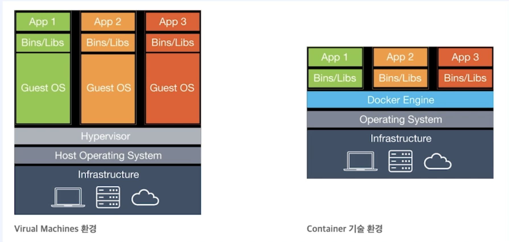
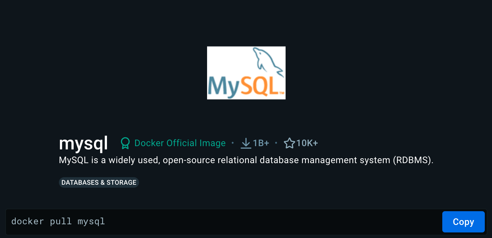
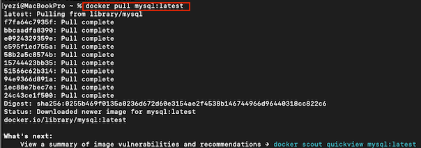
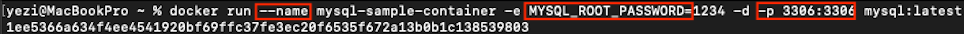
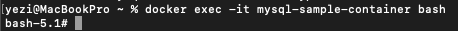
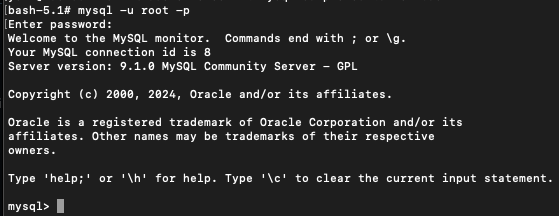

# 도커 및 도커 컴포즈를 통한 환경설정

## 도커

컨테이너 기반의 가상화 플랫폼

> 컨테이너 기반의 가상화 vs 하이퍼바이저 기반의 가상화(OS 가상화)
> 
>
> - `하이퍼바이저 기반의 가상화` <u>: 격리 된 환경에서 또 하나의 가상서버를 실행하는 기술</u>
>
>   하나의 컴퓨터에서 다수의 독립적인 OS를 운영한다. 하이퍼바이저는 하나의 컴퓨터에서 여러 OS를 동시에 실행하기 위한 소프트웨어를 뜻하며 이 하이퍼바이저가 각각의 Guest OS(가상서버)들을 관리하며 시스템 자원을 할당한다. **하나의 물리적 서버 위에 존재하는 Host OS,  하이퍼바이저, 
>   그 위에 존재하는 다수의 독립적 OS들**
>   로 구성된다.  하나의 물리적 서버 위에 Host OS 가 존재하고, 그 위에 다수의 독립적인 OS가 가상으로 들어갈 수 있도록 한다. 각각의 OS는 서로에 대해 알지 못하며 Host OS조차 알지 못한다. 하나의 물리적 서버에서 실행되고 있지만 완전히 독립적인 OS로서 운영되는 것이다.   <u>ex) VMware, VirtualBox</u> 
>
>   하이퍼바이저 기반의 가상화 방식은 사용법이 간단하지만 기술적으로 무거워지는 단점이 있다. 각각의 독립적인 OS를 모두 실행시켜야 하기 때문에 부팅 시간이 길며 리소스 또한 많이 차지할 수 밖에 없다. 따라서 실제 운영환경에서는 사용이 어렵다.
>
> - `컨테이너 기반의 가상화`  <u>: 격리 된 환경에서 프로세스를 실행하는 기술</u>
>
>   프로세스를 격리된 환경에서 실행하는 기술. 리눅스에서는 이러한 방식을 <u>리눅스 컨테이너</u>라고 한다. OS를 가상화 하는 것이 아니라 운영체제 수준의 가상화 기술로 리눅수 커널을 공유함과 동시에 프로세스를 격리된 환경에서 실행하므로 가볍고 빠르게 동작한다. 다수의 컨테이너를 실행하면 컨테이너끼리 서로 영향을 끼치지 않음과 동시에 독립적으로 실행된다. 실행중인 컨테이너에 접속하여 명령어를 입력하거나 패키지를 설치하는 등의 다양한 작업이 가능하며 CPU 혹은 메모리를 제한할 수도 있고, 호스트 디렉토리에 마운트하여 내부 디렉토리로 사용할 수도 있다.  또한 하나의 프로세스(컨테이너)를 실행하는데 필요한 모든 파일을 이미지로 만들어 제공하기 때문에 개발 단계부터 프로덕션에 이르기까지 일관된 환경을 유지할 수 있다.
>
>   

- [도커 허브](https://hub.docker.com) : 도커에서 제공하는 이미지 저장소
- [도커 컴포즈](https://docs.docker.com/compose) : 다중 컨테이너를 정의하고 실행하기 위한 도구, YAML 파일을 사용하여 다중 컨테이너를 구성한다.

# 도커를 이용한 환경 구성하기

[도커 다운로드](https://www.docker.com/)

- 도커 버전 확인 : `docker -v`

#### 예시 - Mysql 이미지 다운로드 

1. 도커 허브에서 이미지로 다운받고자 하는 어플리케이션 검색  
   {: style="width:50%; height:50%;"}

2. termianl에서 `docker pull mysql` 입력 (버전정보를 추가하고싶은 경우 `docker pull mysql:latest`처럼 뒤에 :버전정보 를 함께 입력한다.)

   - ‼️ **주의** ‼️  도커 이미지를 다운받기 위해서는 Docker데몬이 실행되고 있어야한다. Docker 데몬은 Docker 명령어를 실행하는데 필요한 핵심 서비스로, 데몬이 실행중이어야만 docker pull, docker run 등의 명령어를 정상적으로 사용할 수 있다. 

   

3. 도커 컨테이너 생성 및 실행

   `docker run --name mysql-sample-container -e MYSQL_ROOT_PASSWORD=<password> -d -p 3306:3306 mysql:{version}`
   

   - 현재 실행중인 도커 컨테이너 목록을 출력하는 명령어 : `docker ps -a`
   - [도커 명령어 공식 문서](https://docs.docker.com/reference/cli/docker/container/run/)

4. 도커 컨테이너 접속

   `docker exec -it {도커 컨테이너 이름} bash` 

   - MySQL 접속 `mysql -u root -p` 

