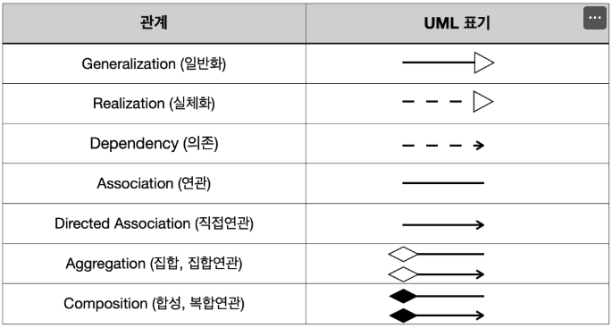
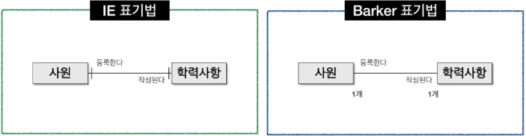
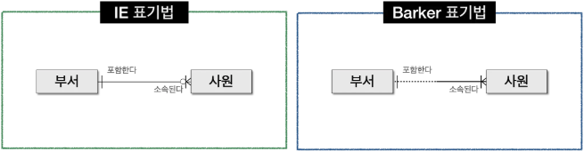
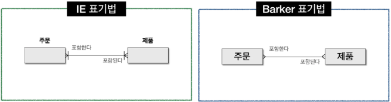
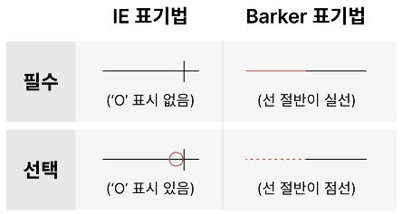
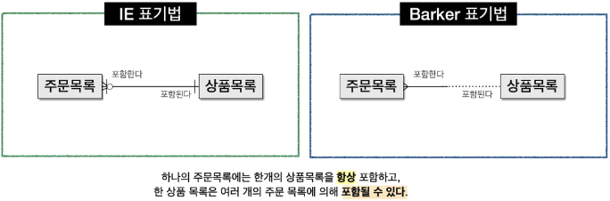
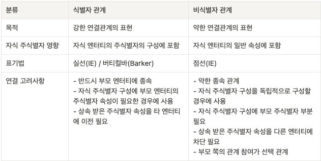

### ✅ 데이터 모델링의 요소

#### 엔터티 (Entity)

1. **엔터티의 개념** 
   데이터 모델의 핵심 구성요소. 엔터티는 하나의 개체를 의미하며, 데이터베이스에서 레코드가 개체에 해당한다.
2. **엔터티와 인스턴스** 엔터티는 인스턴스의 집합이고 엔터티와 인스턴스의 관계는 여러가지 방법으로 표현할 수 있다. 하나의 엔터티(table)는 여러 인스턴스(row)을 가질 수 있고, 1개 이상의 속성(column)을 가질 수 있다. 
3. **엔터티의 특징**
   - <u>업무에서 필요로 하는 정보</u>
   - <u>식별 가능 여부</u>  : 엔터티를 도출하는 경우, 업무적으로 의미를 갖는 인스턴스가 식별자에 의해 한 개씩만 존재하는 검증
   - <u>인스턴스의 집합</u>  : 엔터티는 기본적으로 2개 이상의 인스턴스로 구성되어야 한다. 따라서 인스턴스가 한 개 밖에 없는 엔터티는 집합이 아니므로 엔터티가 아니다.
   - <u>업무프로세스에 의해 활용되어야 함</u>
   - <u>속성을 포함해야한다</u> 주 식별자만 존재하고 일반 속성은 전혀 없는 경우 엔터티가 아니다. 엔터티는 엔터티를 설명할 수 있는 속성이 존재해야 의미를 갖는다.
   - <u>관계의 존재</u> 관계가 설정되지 않은 엔터티는 부적절하거나 아직 다른 엔터티와의 직접적인 연결을 찾지 못한 상태이다.
4. **엔터티의 분류**
   1. **유/무형에 따른 분류**
      - <mark>유형 엔터티</mark> - 물리적 형태가 존재하는 엔터티 ex) 상품, 강사, 병장
      - <mark>개념 엔터티</mark> - 개념적 정보로 구분되는 엔터티 ex) 학과, 코스닥 종모
      - <mark>사건 엔터티</mark> - 특정한 이벤트에 종속되는 엔터티 ex) 이벤트 응모, 주문 
   2. **발생 시점에 따른 분류**
      - <mark>기본/키 엔터티(Basic Entity)</mark> 관계가 아닌 독립적인 생성이 가능하고, 다른 엔터티의 부모 엔터티 역할을한다. 즉 고유한 주식별자를 갖는다 ex) 고객, 상품
      - <mark>중심 엔터티(Main Entity)</mark> 기본엔터티로부터 파생되고 업무에서 중심적인 역할을 한다 ex) 주문, 취소
      - <mark>행위 엔터티(Active Entity)</mark> 두 개 이상의 부모 엔터티로 부터 발생하며, 내용이 자주 바뀌거나 증가한다. ex) 주문 내역, 취소 내역

#### 속성 (Attribute)

1. **속성의 개념** 인스턴스가 가진 어떠한 성질(성격) 업무에서 필요로 하는 인스턴스로 관리하고자 하는 의미상 **<mark>더 이상 분리되지 않는 최소의 데이터 단위</mark>** 한 개의 속성은 한 개의 속성값을 갖는다.

2. **속성의 특징**

   1. 속성은 업무에서 필요로 해야한다
   2. 속성은 의미상 더 이상 분리되지 않는 그 자체로 독립성을 유지한다
   3. 엔터티를 설명하고 인스턴스의 구성요소가 된다
   4. 정규화 이론에 기반을 두고 정해진 주식별자에 함수적 종속성을 가져야한다
   5. 하나의 속성은 한개의 값만 갖는다

   > **cf) 함수적 종속성**  X → Y (X: 결정자, Y: 종속자) X의 값을 알면 Y의 값을 바로 알 수 있고 X값에 의해 Y값이 달라진다면, 이를 Y는 X에 함수적 종속이라고 함

3. **<mark>속성의 분류</mark>**

   - 속성의 **특징**에 따른 분류 
     
   - 엔터티 **구성 방식**에 따른 분류 

4. **도메인** 각 속성이 가질 수 있는 값의 범위를 의미하며, <u>엔터티 내에서 속성에 대한 데이터 타입과 크기, 제약사항등을 지정</u>한다.

#### 관계 (Relationship)

1. **관계의 개념** 상호 연관성이 있는 상태. 엔터티와 인스턴스 사이의 논리적인 연관성으로서 존재의 형태 행위로서 서로에게 연관성이 부여된 상태
2. **관계의 페어링** 관계는 엔터티 안에 인스턴스가 개별적으로 연결되어 있는 구조이며 이러한 관계를 `페어링`이라고 부른다. 
3. **관계의 분류**
   - <u>존재에 의한 관계</u> 소속/포함의 형태로 볼 수 있다. 회사에서 사원이 언제나 특정한 부서에 속해있는 것은 존재에 의한 관계로 볼 수 있다.
   - <u>행위에 의한 관계</u> 행동/행위의 결과로 나타난다. 고객이 주문을 하는경우 주문이라는 행동은 고객이 직접 행해야 발생하므로 행위에 의한 관계로 볼 수 있다.
4. **UML(Unified Modeling Language) - 통합모델링 언어** 소프트웨어 공학에서 사용되는 표준화 된 범용 모델링 언어로 추상화 된 시스템을 특정한 모델로 표현해주는 언어를 의미한다. 여러 종류의 UML 다이어 그램을 통해 시각화 된 형태의 모델링 된 결과를 살펴볼 수 있다. 클래스 다이어그램은 정적 다이어그램으로 클래스의 구성요소 및 클래스 간의 관계를 표현하는 대표적인 UML이다.  클래스 다이어그램의 관계는 연관관계(Association)과 의존관계(Dependency)가 있다. 연관관계(실선)은 항상 이용하는 관계로 존재적 관계에 해당하고, 의존관계(점선)은 상대방 클래스에 의해 관계가 형성 될 때를 구분하여 표현한다. <u>ERD에서는 존재적 관계와 행위에 의한 관계를 구분하지 않는다는 차이가 있다.</u>

##### ⭐️관계표기법

- **<mark>관계차수(Degree / Cardinality)</mark> ⭐️⭐️⭐️⭐️⭐️** 두 개의 엔터티 간의 관계에서 참여자 수를 표현하는 것을 관계차수라한다.  일반적으로 1:1, 1:M, M:M이 있다.

  - 1:1 (ONE TO ONE) 관계표시 
  - 1:M (ONE TO MANY) 관계표시 
  - M:M (MANY TO MANY) 관계표시 

- **관계선택자 (Optionality)** 참여하는 엔터티가 항상 참여하는지 아니면 참여할 수도 있는지를 나타내는 방법으로 필수(Mandatory Membership)와 선택참여(Optional Membership)가 있다.

  - 필수조건 실선으로 표시, 상대 Entity에 대한 해당 조건을 만족하는 Entity가 반드시 존재하는 경우 표시 

  - 선택조건 점선으로 표시, 상대 Entity에 대한 해당 조건을 만족하는 Entity가 존재할수도 하지않을수도 있는 경우 표시

     

#### 식별자 (Identifier)

1. **식별자의 개념** 엔터티의 인스턴스를 구분 가능하게 만들어주는 대표격의 속성
   - **주식별자(Primary Key)의 특징**
     - <mark>유일성</mark> 주식별자에 의해 엔터티 내에 모든 인스턴스를 유일하게 구분한다.
     - <mark>최소성</mark> 주식별자를 구성하는 속성의 수는 유일성을 만족하는 최소의 수가 되어야한다.
     - <mark>불변성</mark> 한 번 특정 엔터티에 지정되면 그 식별자의 값은 변하지 않아야 한다
     - <mark>존재성</mark> Null값을 허용하지 않는다
2. **식별자의 분류**  

3. **주식별자 도출기준**

   1. 해당업무에서 자주 이용되는 속성으로 설정한다
   2. 명칭, 내역 등과 같이 특정한 이름으로 기술되는 것은 가능하면 주식별자로 사용하지 않는다
   3. 복합으로 주식별자를 구성하는 경우 너무 많은 속성이 포함되지 않도록 한다

4. **식별자 관계와 비식별자 관계예 따른 식별자**

   1. **식별자 관계와 비식별자 관계의 결정 요인** 

      관계와 속성을 정의하고 주식별자를 결정하면 논리적 관계에 의해 자연스럽게 외부식별자가 도출되면, 엔터티에 주식별자가 지정되고 엔터티간의 관계를 연결하면 부모쪽의 주식별자를 자식 엔터티의 속성으로 보내게 된다. 이 때 <u>자식 엔터티에서 부모엔터티로부터 받은 외부식별자를 주식별자로 쓸 것인지 혹은 부모와 연결 된 속성(Foreign Key)로 이용할 것인지 결정</u>하게 된다.

   2. **<mark>식별자 관계</mark>** 부모로부터 받은 식별자를 자식엔터티의 주식별자로 사용하는 경우 식별관계라고한다. 이 경우 부모의 값은 비어있으면 안된다.

   3. **<mark>비식별자 관계</mark>** 부모로부터 받은 식별자를 자식엔터티의 일반속성으로 사용하는 경우 비식별관계라 한다.

   4. **<mark>식별자관계와 비식별자 관계의 비교</mark>** 

      
