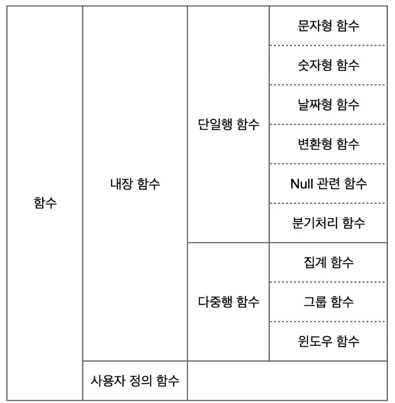

### 관계형 데이터베이스의 개요 

- **관계형 데이터베이스**<br>데이터베이스를 체계적으로 관리하고 운영하는 소프트웨어<br>사용자가 정해진 방식으로 요청하면 행과 열의 2차원 관계로 정의된 데이터의 `생성,수정,삭제 그리고 조회`가 가능하다.


- **<mark>SQL</mark>**<br>관계형 데이터베이스와 통신할 때 사용되는 구조화된 질의언어. CRUD를 수행하기 위해 존재
  - **데이터 정의 언어 (DDL Data Definition Language)**
    - 데이터베이스의 구조를 정의하는데 사용하는 언어
    - 데이터를 저장하는 테이블을 만들거나 수정할 수 있다.
    - 테이블을 생성(CREATE), 변경(ALTER, RENAME), 삭제(DROP) 할 수 있다.
  - **데이터 조작 언어 (DML Data Manipulation Language)**
    - 테이블에 저장된 데이터를 조작하는데 사용되는 언어
    - 데이터를 삽입(INSERT), 조회(SELECT), 수정(UPDATE), 삭제(DELETE) 할 수 있다.
  - **데이터 제어 언어 (DCL Data Control Language)**
    - 데이터베이스에 접근하여 이를 제어하기 위한 권한을 관리하는데 사용
    - 데이터베이스 사용권한을 부여하거나 박탈한다 / 부여 (GRANT) , 회수 (REVOKE)
  - **트랜젝션 제어어 (TCL : Transaction Control Language)**
    - DML에 의해 조작된 결과를 작업단위 (트랜잭션)별로 제어하는 언어
    - COMMIT, ROLLBACK 등의 명령어 수행
- **<mark>SQL문 (Statement) & 절(Clause)</mark>**
  - <u>문(Statement)</u>
    - 독립적으로 실행할 수 있는 완전한 SQL 코드 조각
    - 문은 절로 구성 됨
  - <u>절(Clause)</u>
- **<mark>테이블</mark>**
  - 행과 열로 구성 된 2차원의 데이터 저장 구조
  - **column  / 열 / 속성** 
  - **row / 행 / 레코드** : 테이블에 실제 저장되는 데이터 (인스턴스)

### DDL

#### SELECT - 데이터 조회

```sql
SELECT 컬럼
FROM 테이블
WHERE 조건식
GROUP BY 그룹 컬럼
HAVING 그룹 조건
ORDER BY 정렬
-- 실행순서
-- FROM > WHERE > GROUB BY > HAVING > SELECT > ORDER BY
```

- **DISTINCT - 중복제거**

  ```sql
  SELECT DISTINCT first_name FROM employees;
  ```

- **산술연산자**

  ```sql
  SELECT 10 + 5 AS addition,
         15 - 7 AS subtraction,
         6 * 3 AS multiplication,
         20 / 4 AS division,
         MOD(17, 5) AS modulo
  FROM dual;
  ```

- **합성연산자**

  ```sql
  SELECT 문자형1 || 문자형2 FROM 테이블_이름;
  SELECT CONCAT(문자형1, 문자형2) FROM 테이블_이름;
  ```

#### 함수 - 단일행함수



##### 단일행 함수의 특징 

- 단일행 내에 있는 하나의 값 또는 여러 값이 입력인수로 표현될 수 있다.
- 함수의 리턴값은 항상 1개 (단일값)
- <u>SELECT, WHERE, ORDER BY</u> 절에서 사용가능
- 함수의 인자로 상수, 변수, 표현식 사용가능
- 하나의 인수를 가지는 경우도 있지만, 여러개의 인수를 가지는 경우도 있다.
- 특별한 경우가 아닌 경우 함수의 인자로 함수를 사용하는 함수의 중첩이 가능

##### 단일행 함수의 종류

- <mark>문자형</mark>

  ```sql
  SELECT LOWER('SQL Expert') FROM DUAL; -- 'sql expert'
  SELECT UPPER('SQL Expert') FROM DUAL; -- 'SQL EXPERT'
  SELECT CONCAT('RDBMS', ' SQL') FROM DUAL; -- 'RDBMS SQL'
  SELECT ASCII('A') FROM DUAL; -- 65
  SELECT CHR(65) FROM DUAL;-- 'A'
  SELECT SUBSTR('SQL Expert', 5, 3) FROM DUAL;-- 'Exp'
  SELECT LENGTH('SQL Expert') FROM DUAL;-- 10
  
  -- 양쪽 제거
  SELECT TRIM('x' FROM 'xxYYZZxYZxx') FROM DUAL;-- 'YYZZxYZ'
  -- 첫번째 문자부터 확인해서 지정문자가 나타나면 해당 문자를 문자열에서 제거한다, 지정문자의 기본값은 공백값
  SELECT LTRIM('xxxYYZZxYZ', 'x') FROM DUAL;-- 'YYZZxYZ'
  SELECT TRIM(leading'x' FROM 'xxYYZZxYZxx') FROM DUAL;
  -- 마지막 문자부터 확인해서 지정문자가 나타나면 해당 문자를 문자열에서 제거한다, 지정문자의 기본값은 공백값
  SELECT RTRIM('XXYYzzXYzz', 'z') FROM DUAL;-- 'XXYYzzXY'
  SELECT TRIM(trailing 'x' FROM 'xxYYZZxYZxx') FROM DUAL;
  
  -- (문자열1,n,[,문자열2]) 문자열1을 n자리만큼 늘리고 왼쪽/오른쪽 빈 공간을 문자열2로 채워 리턴
  SELECT LPAD('ABC',8,'Z') FROM dual;-- ZZZZZABC
  SELECT RPAD('ABC',8) FROM dual;-- ABC(공백 5칸)
  ```

- <mark>숫자형</mark>

  ```sql
  SELECT ABS(-15) FROM DUAL;-- 15
  SELECT SIGN(-10) FROM DUAL;-- -1 / 부호판단
  SELECT MOD(7, 3) FROM DUAL;-- 1 / 나머지연산
  SELECT CEIL(38.567) FROM DUAL;-- 39 / 올림
  SELECT FLOOR(38.567) FROM DUAL;-- 38 / 내림
  SELECT ROUND(38.567, 2) FROM DUAL;-- 38.57 / 반올림, 자리수 지정
  SELECT TRUNC(38.567, 2) FROM DUAL;-- 38.56 / 버림, 자리수 지정
  ```

- <mark>날짜형</mark><br>데이터베이스는 날짜를 저장할 때 내부적으로 세기(Century), 년(Year). 월(Month), 일(Day), 시(Hour), 분(Minutes), c초(Seconds)와 같은 숫자형식으로 변환하여 저장한다. 데이터베이스는 날짜를 숫자로 저장하므로 덧셈, 뺄셈 같은 산술연산자로도 날짜 계산이 가능하다

  > - 날짜 + 숫자 = 날짜
  >   - 숫자만큼의 날수를 날짜에 더하는 연산입니다.
  > - 날짜 - 숫자 = 날짜
  >   - 숫자만큼의 날수를 날짜에서 빼는 연산입니다.
  > - 날짜1 - 날짜2 = 날짜수
  >   - 다른 하나의 날짜에서 하나의 날짜를 빼서 나오는 일수를 구할 수 있습니다.
  > - 날짜 + 숫자/24 = 날짜
  >   - 시간을 날짜에 더할 수 있습니다.

  - 데이터포맷함수(DATA_FORMAT)<br>날짜 및 시간을 특정 형식으로 변환하여 표시하기 위해 사용되는 함수로 날짜와 시간을 다양한 형식으로 변환할 수 있도록 도와준다. 

  ```sql
  -- DATE_FORMAT(date, format)
  -- date : 형식을 지정할 날짜 또는 시간
  -- %Y 4자리 연도 / %y 2자리 연도 / %m 2자리 월 / %d 2자리 일 / %H 2자리 시간
  -- format : 날짜 및 시간을 변환할 형식을 지정하는 문자열
  
  SELECT SYSDATE FROM DUAL;-- 현재 날짜와 시간 출력 01-MAR-25
  SELECT EXTRACT(YEAR FROM DATE '2023-10-10') FROM DUAL;-- 2023
  SELECT CAST(SYSDATE AS TIMESTAMP), EXTRACT(HOUR FROM CAST(SYSDATE AS TIMESTAMP)) from DUAL;
  -- 01-MAR-25 01.07.26.000000 PM	/ 13
  
  -- 날짜 데이터에서 년/월/일 데이터 출력, TO_NUMBER 함수 제외시 문자형으로 출력
  -- 1993 / hire-date : '1993-02-25'
  SELECT TO_NUMBER(TO_CHAR(hire_date,'YYYY')) FROM empl;
  ```

- <mark>변환형</mark>

  - 명시적

    ```sql
    SELECT TO_CHAR(SYSDATE, 'YYYY. MON, DAY') FROM DUAL;
    SELECT TO_NUMBER('888') + TO_NUMBER('111') FROM DUAL;
    SELECT TO_DATE('2021-12-12', 'YYYY-MM-DD') FROM DUAL;
    ```

  - 암시적 - 데이터가 스스로 타입을 변경하기 때문에 편하지만 성능 저하 발생가능

    ```sql
    SELECT '2' + 1 FROM DUAL; -- 3
    ```

- <mark>NULL</mark>

  ```sql
  -- NVL(NULL_판단_대상, NULL일_때_대체값)
  -- 값이 NULL인 경우 두 번째 지정값을 출력하고, 그렇지 않으면 대상 데이터를 출력합니다.
  SELECT NVL(NULL, 'NVL-OK') FROM DUAL;-- NVL-OK
  
  -- NULLIF (EXPR1, EXPR2)
  -- 두 조건 EXPR1과 EXPR2를 비교하고 같다면 NULL을 리턴하고, 같지 않으면 첫 번째 EXPR1을 리턴
  SELECT NULLIF(mgr, 7698) AS result1 FROM emp;
  
  -- COALESCE(EXPR1, EXPR2, EXPR3, ...)
  -- COALESCE 함수는 여러 값 중에서 NULL이 아닌 첫 번째 값을 찾을 때 사용
  SELECT ename, comm, sal, COALESCE(comm, sal) coal FROM emp;
  ```

- <mark>분기처리</mark><br>`case`표현 : 조건부로 값을 반환하거나 연산을 수행하는데 사용되는 구문

  ```sql
  CASE
      WHEN condition1 THEN result1
      WHEN condition2 THEN result2
      ...
      ELSE result_else
  END
  
  -- CASE 다음에 WHEN 절에서 EQUAL(=) 조건 포함 
  -- 여러 조건을 이용한 조건절을 사용할 수 있어 다양한 조건에 대한 결과 설정 가능.
  SELECT ename, 
  	CASE 
  		WHEN sal >= 3000 THEN 'HIGH' 
  		WHEN sal >= 1000 THEN 'MID' 
  		ELSE 'LOW' 
  	END AS SALARY_GRADE
  FROM emp;
  ```

  `decode`표현 : 조건을 평가하여 값을 반환하는 함수로, 주로 간단한 조건과 대응하는 결과 값을 처리할 때 사용

  ```sql
  -- player 테이블에서 선수 이름과
  -- position이 MF 이면 미드필더, FW 면 공격수를 리턴하고
  -- 둘 다 아니라면 교체선수를 리턴합니다.
  SELECT player_name, 
  	DECODE(position, 'MF', '미드필더', 'FW', '공격수', '교체선수')
  FROM player;
  ```

  
